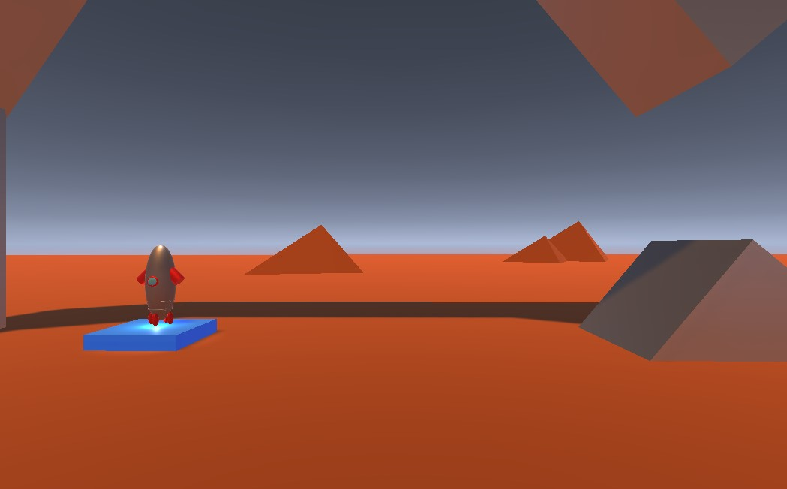
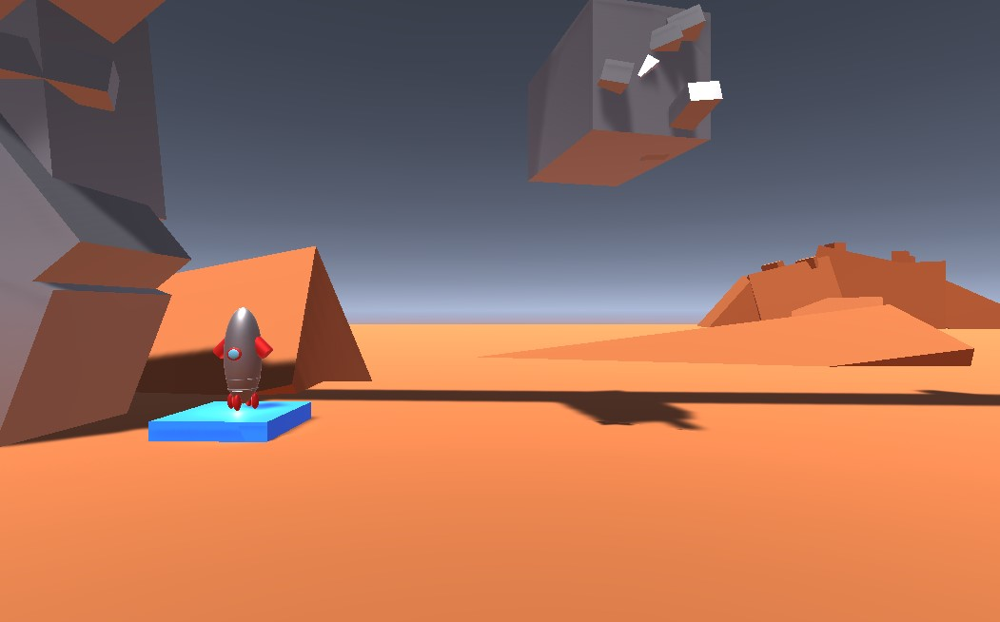

# Project Boost

I have made this little game while learning Unity.
This is one of the projects in Unity 3D Game dev course on Udemy.com from GameDev.tv.
I have also added some details that were not included in the course.

## Can I play it?
Yes you can!
Published here: https://sharemygame.com/@mknycha/escape-from-mars

The goal is to land your rocket on the green tile.

Use left and right arrows to rotate the rocket.
Use space to boost.

You can also clone the repo and build the project in Unity.

